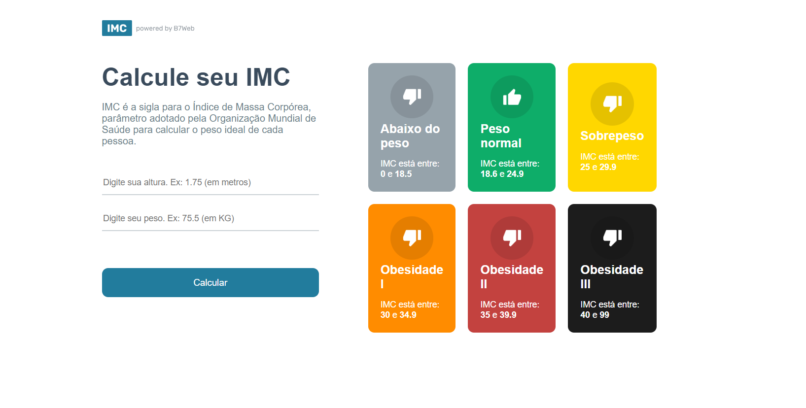

# Calculadora de IMC

Este é um projeto desenvolvido em React e TypeScript, que implementa uma calculadora de IMC (Índice de Massa Corporal). A calculadora de IMC permite aos usuários calcular seu IMC com base no peso e altura fornecidos, ajudando a avaliar se estão dentro de uma faixa de peso saudável.

### Funcionalidades
- `Entrada de peso e altura`
- `Cálculo do IMC`
- `Exibição da categoria de IMC (ex.: Abaixo do peso, Peso normal, Sobrepeso, Obesidade)`

### Pré-requisitos

Certifique-se de ter o Node.js e npm instalados em sua máquina.

### Instalação
- `npm install`

### Para rodar
Para iniciar o servidor de desenvolvimento e rodar a aplicação localmente, execute o comando:
`npm start`

### Como usar
- `Insira seu peso (em kg) e altura (em cm) nos campos fornecidos.`

- `Clique no botão "Calcular" para ver seu IMC e a categoria correspondente.`

### Tecnologias Utilizadas

- `React`

- `TypeScript`

Se você tiver alguma dúvida ou sugestão, sinta-se à vontade para abrir uma issue ou enviar um pull request.